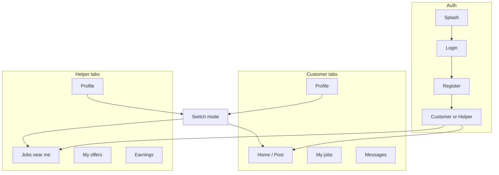
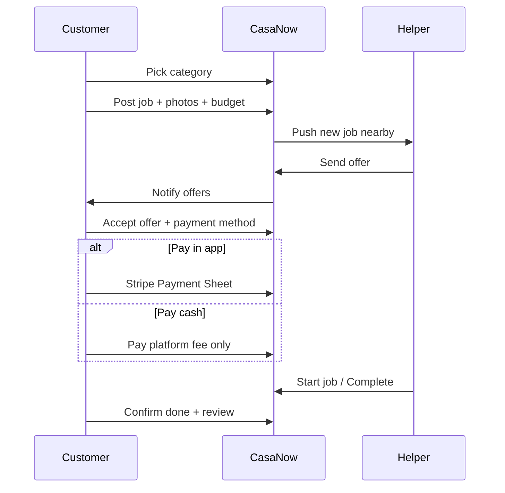
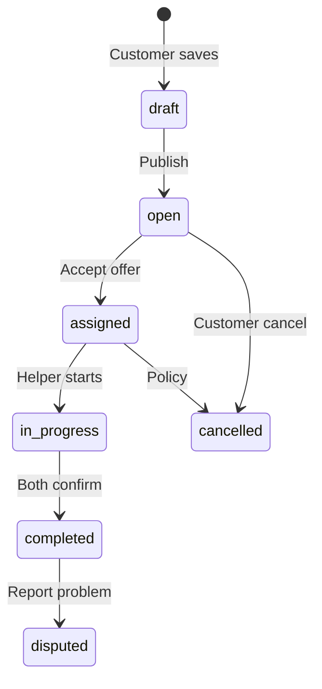

# CasaNow — App sketches (UX)

Low-fidelity wireframes for how the mobile app could work. Aligns with [BUSINESS_PLAN.md](./BUSINESS_PLAN.md) and [TECH_PLAN.md](./TECH_PLAN.md). Not final UI design—enough to align builders, investors, and helpers before Figma.

**v1 assumption:** One app; user can be **customer**, **helper**, or both (role switch in profile). Production app: **Spanish + English** (i18n). **Wireframe labels below are in English** for readability.

---

## App map



---

## Customer: happy path



---

## Screen inventory

| Screen | Customer | Helper |
|--------|:--------:|:------:|
| Splash / onboarding | ✓ | ✓ |
| Login / register | ✓ | ✓ |
| Category picker | ✓ | |
| Post job (multi-step) | ✓ | |
| Job detail (posted) | ✓ | ✓ |
| Offers list | ✓ | |
| Accept + pay | ✓ | |
| My jobs list | ✓ | |
| Jobs feed (map/list) | | ✓ |
| Send offer | | ✓ |
| Stripe Connect onboarding | | ✓ |
| Earnings / payouts | | ✓ |
| Chat thread | ✓ | ✓ |
| Review | ✓ | ✓ |
| Profile / settings | ✓ | ✓ |

---

## 1. Onboarding & auth

```
┌─────────────────────────────┐
│         CasaNow             │
│   Home help · Marbella      │
├─────────────────────────────┤
│                             │
│   [ Home illustration ]     │
│                             │
│   ┌─────────────────────┐   │
│   │ Continue with email │   │
│   └─────────────────────┘   │
│   ┌─────────────────────┐   │
│   │ Continue with Apple │   │
│   └─────────────────────┘   │
│                             │
│   ES │ EN                    │
└─────────────────────────────┘
```

After first login: short carousel → “Do you want to get help or offer help?” → **Get help** | **Offer help** | **Both**.

---

## 2. Customer home — category grid (Tiptapp-style)

```
┌─────────────────────────────┐
│  ○ Marbella          [?][👤] │
├─────────────────────────────┤
│  What do you need?          │
│                             │
│  ┌──────┐  Pool & garden    │
│  │ 🏊  │  Pool cleaning      │
│  └──────┘                   │
│  ┌──────┐  Assembly / handyman│
│  │ 🔧  │  Furniture, shelves │
│  └──────┘                   │
│  ┌──────┐  One-off cleaning │
│  │ ✨  │  (v2)              │
│  └──────┘                   │
│                             │
│  ┌─────────────────────────┐│
│  │  + Post another job      ││
│  └─────────────────────────┘│
├─────────────────────────────┤
│  Home    My jobs      💬    │
└─────────────────────────────┘
```

Tap category → **Post job** flow.

---

## 3. Post job (wizard)

**Step 1 — Describe**

```
┌─────────────────────────────┐
│  ←   Post a job             │
├─────────────────────────────┤
│  Pool & garden              │
│                             │
│  Title                      │
│  ┌─────────────────────────┐│
│  │ Clean 8x4 pool         ││
│  └─────────────────────────┘│
│  Description                │
│  ┌─────────────────────────┐│
│  │ Green water, skimmer...││
│  └─────────────────────────┘│
│  Photos (max 6)             │
│  [📷] [img] [img] [ + ]     │
│                             │
│         [ Next → ]          │
└─────────────────────────────┘
```

**Step 2 — Where & when**

```
┌─────────────────────────────┐
│  ←   Location & date        │
├─────────────────────────────┤
│  ┌─────────────────────────┐│
│  │     [ Map pin ]         ││
│  │  Nueva Andalucía        ││
│  └─────────────────────────┘│
│  Access notes (optional)    │
│  ┌─────────────────────────┐│
│  │ Gate code, plot 42     ││
│  └─────────────────────────┘│
│  When                       │
│  ○ As soon as possible      │
│  ○ Pick a date              │
│         [ Next → ]          │
└─────────────────────────────┘
```

Geofence: if pin outside Marbella polygon → “Only available in Marbella for now.”

**Step 3 — Budget & payment preference**

```
┌─────────────────────────────┐
│  ←   Budget                 │
├─────────────────────────────┤
│  Your budget (EUR)          │
│  ┌─────────────────────────┐│
│  │  80                     ││
│  └─────────────────────────┘│
│  ○ Fixed price              │
│  ○ Receive offers           │
│                             │
│  Payment preference         │
│  ● Pay in app (recommended) │
│  ○ Cash to helper           │
│                             │
│  Platform fee: 15%          │
│  (info ℹ️)                  │
│                             │
│  ┌─────────────────────────┐│
│  │   Post job               ││
│  └─────────────────────────┘│
└─────────────────────────────┘
```

---

## 4. Customer — job open (waiting for offers)

```
┌─────────────────────────────┐
│  ←   Clean 8x4 pool         │
├─────────────────────────────┤
│  Status: ● Waiting for offers│
│  [ photo carousel ]         │
│  €80 · ASAP                 │
│  Nueva Andalucía            │
├─────────────────────────────┤
│  Offers (2)                 │
│  ┌─────────────────────────┐│
│  │ Ana M. ★4.8  ·  €75     ││
│  │ Free this afternoon...  ││
│  │    [ View ] [ Accept ]  ││
│  └─────────────────────────┘│
│  ┌─────────────────────────┐│
│  │ Carlos ★4.5  ·  €80     ││
│  └─────────────────────────┘│
│  [ Cancel job ]             │
├─────────────────────────────┤
│  Home    My jobs      💬    │
└─────────────────────────────┘
```

---

## 5. Accept offer + pay

```
┌─────────────────────────────┐
│  ←   Confirm                │
├─────────────────────────────┤
│  Helper: Ana M. ★4.8        │
│  Agreed price: €75          │
│  Platform fee: €11.25       │
│  ─────────────────────      │
│  Total due now:             │
│  €86.25  (pay in app)       │
│                             │
│  ┌─────────────────────────┐│
│  │  Pay with Apple Pay     ││
│  └─────────────────────────┘│
│  ┌─────────────────────────┐│
│  │  Card                   ││
│  └─────────────────────────┘│
│                             │
│  Payment releases to helper │
│  when the job is completed. │
└─────────────────────────────┘
```

**Cash path (same screen, different totals):**

```
│  Job: €75 cash to helper     │
│  when finished.             │
│  CasaNow fee now: €2.99     │
│  ┌─────────────────────────┐│
│  │  Pay €2.99 fee          ││
│  └─────────────────────────┘│
```

---

## 6. Job in progress (both sides)

```
┌─────────────────────────────┐
│  ←   In progress            │
├─────────────────────────────┤
│  Ana M.          [ 💬 Chat ]│
│  ETA: today 5:00 PM         │
│                             │
│  [ photo ] [ map optional ] │
│                             │
│  Helper sees:               │
│  ┌─────────────────────────┐│
│  │  ▶ Start job            ││
│  └─────────────────────────┘│
│  ┌─────────────────────────┐│
│  │  ✓ Mark completed       ││
│  └─────────────────────────┘│
│                             │
│  Customer sees:             │
│  Waiting for confirmation...│
│  ┌─────────────────────────┐│
│  │  Confirm completed      ││
│  └─────────────────────────┘│
│  [ Report a problem ]       │
└─────────────────────────────┘
```

Cash job: extra row “I paid cash” / “I received cash”.

---

## 7. Helper — jobs near me

```
┌─────────────────────────────┐
│  Jobs nearby         [Map][≡]│
├─────────────────────────────┤
│  Radius: 8 km   [ Filters ] │
│  Categories: Pool ✓           │
├─────────────────────────────┤
│  ┌─────────────────────────┐│
│  │ €75 · Pool              ││
│  │ Clean 8x4 pool          ││
│  │ 2.1 km · Today          ││
│  │ [img thumb]             ││
│  └─────────────────────────┘│
│  ┌─────────────────────────┐│
│  │ €40 · Handyman          ││
│  │ Assemble IKEA shelf     ││
│  └─────────────────────────┘│
├─────────────────────────────┤
│  Nearby  Offers  Earnings 👤│
└─────────────────────────────┘
```

**Map tab:** pins for open jobs; tap pin → bottom sheet → “View details”.

---

## 8. Helper — job detail + send offer

```
┌─────────────────────────────┐
│  ←   Details                │
├─────────────────────────────┤
│  [ photos ]                 │
│  Clean 8x4 pool             │
│  Customer budget: €80       │
│  Nueva Andalucía · 2.1 km   │
│  ASAP                       │
├─────────────────────────────┤
│  Your offer (EUR)           │
│  ┌─────────────────────────┐│
│  │ 75                      ││
│  └─────────────────────────┘│
│  Message                    │
│  ┌─────────────────────────┐│
│  │ I have experience...    ││
│  └─────────────────────────┘│
│  ┌─────────────────────────┐│
│  │   Send offer            ││
│  └─────────────────────────┘│
│  (Connect + self-employed OK)│
└─────────────────────────────┘
```

If Stripe Connect incomplete → block with CTA “Set up payouts”.

---

## 9. Helper — Connect onboarding gate

```
┌─────────────────────────────┐
│  Set up payouts             │
├─────────────────────────────┤
│  To receive in-app paid    │
│  jobs:                      │
│                             │
│  ✓ CasaNow account          │
│  ○ Tax ID / ID document     │
│  ○ Bank account             │
│  ○ Self-employed declared   │
│                             │
│  ┌─────────────────────────┐│
│  │ Continue with Stripe →  ││
│  └─────────────────────────┘│
│  Cash-only: you can still   │
│  bid with €2.99 fee         │
│  (lower visibility)         │
└─────────────────────────────┘
```

---

## 10. Chat (minimal v1)

```
┌─────────────────────────────┐
│  ←   Ana · Pool             │
├─────────────────────────────┤
│         Hi, what time       │
│         works for you?      │
│  4:30 PM works ✓            │
│                             │
│  ⚠️ Keep agreements and     │
│     payments on CasaNow.    │
├─────────────────────────────┤
│  Message...          [ ➤ ] │
└─────────────────────────────┘
```

No phone number until job assigned (optional masked contact later).

---

## 11. Review & done

```
┌─────────────────────────────┐
│  How was the job?           │
├─────────────────────────────┤
│       ★ ★ ★ ★ ☆             │
│  Comment (optional)         │
│  ┌─────────────────────────┐│
│  │                         ││
│  └─────────────────────────┘│
│  ┌─────────────────────────┐│
│  │      Submit             ││
│  └─────────────────────────┘│
└─────────────────────────────┘
```

---

## Job status (UI labels)



| Status | Customer sees | Helper sees |
|--------|---------------|-------------|
| `open` | Waiting for offers | Can send offer |
| `assigned` | Helper assigned · Pay if due | Go to job |
| `in_progress` | In progress | Start / Complete |
| `completed` | Leave review | View earnings |
| `disputed` | Support will contact you | Same |

---

## Navigation tabs (summary)

**Customer**

```
[ Home ]  [ My jobs ]  [ Messages ]  [ Profile ]
```

**Helper**

```
[ Nearby ]  [ My offers ]  [ Earnings ]  [ Profile ]
```

Profile (both): switch ES/EN, customer ↔ helper mode, notifications, terms, delete account, logout.

---

## Push notifications (examples)

| Event | Who | Copy (EN) |
|-------|-----|-----------|
| New offer | Customer | “Ana offered €75 on your pool job” |
| Offer accepted | Helper | “You got the job! Clean 8x4 pool” |
| Job nearby | Helper | “New job 2 km away · €80” |
| Payment captured | Helper | “Payment released: €63.75” |
| Reminder | Customer | “Confirm if the job is finished” |

*(Ship Spanish strings via i18n for production.)*

---

## v1 vs later (UI scope)

| v1 sketch above | Later |
|-----------------|--------|
| 2–3 categories on home | Full Tiptapp-style grid |
| List + simple map | Clustering, heatmap |
| Email/Apple login | Phone OTP |
| In-app chat | Optional voice / masked call |
| Manual admin via Supabase | Admin app screens |
| Bizum | Third-party PSP button |

---

## Related docs

- [PLAN.md](./PLAN.md) — Index
- [BUSINESS_PLAN.md](./BUSINESS_PLAN.md) — Business rules behind these screens
- [TECH_PLAN.md](./TECH_PLAN.md) — Routes under `app/` map to these flows
- [CRITICAL_REVIEW.md](./CRITICAL_REVIEW.md) — Scope and risk notes
