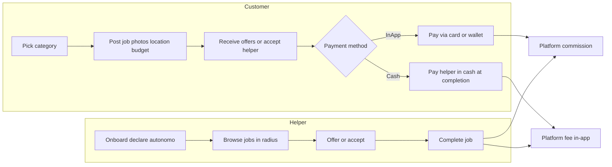
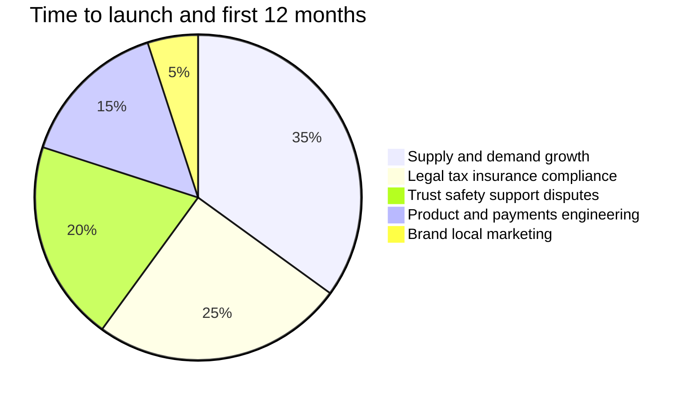

# CasaNow — Business plan (Marbella)

Marketplace for home help on the Costa del Sol: launch **Marbella-first**, you operate the Spanish legal entity. Non-technical work (liquidity, legal, trust, ops) dominates time to a sustainable launch.

**Related:** [TECH_PLAN.md](./TECH_PLAN.md) · [LAUNCH_PLAYBOOK.md](./LAUNCH_PLAYBOOK.md) · [APP_SKETCHES.md](./APP_SKETCHES.md) · [CRITICAL_REVIEW.md](./CRITICAL_REVIEW.md) · [PLAN.md](./PLAN.md) (index)

---

## Checklist (business)

- [ ] Register Spanish SL; gestoría + marketplace lawyer (GDPR, DAC7, helper status, waste category)
- [ ] Recruit and manually vet 20–40 Marbella helpers before public launch
- [ ] Draft Terms + Privacy (template + lawyer)—blocks store submission
- [ ] Book lawyer + gestoría; define commission, cash fee, cancellation policy
- [ ] Interview 10 potential helpers (categories, cash vs card, willingness to use app)
- [ ] Insurance / RC requirements decision for helpers and property-manager channel
- [ ] Launch private beta; ops playbook for disputes and refunds

---

## Product vision (v1)

A **two-sided marketplace**: homeowners post small domestic jobs with photos; local helpers **bid or accept** at an agreed price; payment **in-app** or **cash**; you take a commission.

Inspired by Tiptapp-style categories, adapted for Marbella:

| Category (ES label) | Examples |
|---------------------|----------|
| Piscina y jardín | Pool skim/clean, irrigation, patio |
| Limpieza puntual | Deep clean room, post-renovation |
| Montaje / manitas | IKEA furniture, shelves, TV mount |
| Transporte pequeño | Sofa, appliance, tip run |
| Bortforsling-style | Junk to punto limpio (regulated—see legal) |
| Recados / compras | Store pickup, auction delivery |
| Otros | Catch-all with moderation |

**Suggested v1 cut** (see [CRITICAL_REVIEW.md](./CRITICAL_REVIEW.md)): start with pool/garden + manitas only; defer waste and “Otros.”

**Customer journey (business view):**

---

## What takes the most time

> Marketing often needs **more** founder time than 5% in year one; treat the chart as relative, not a budget.

### 1. Supply & demand (largest long-term cost)

**Chicken-and-egg:** Without helpers, customers churn; without jobs, helpers leave.

- **Marbella:** Spanish residents, expats (EN), seasonality, strong informal cash economy.
- **Launch:** Seed **20–40 vetted helpers** (WhatsApp, Facebook “Manitas Marbella”, urbanización admins, pool/garden freelancers).
- **Demand:** Facebook groups, property managers, holiday-rental agencies.
- **Ongoing:** Part-time ops at local scale indefinitely.

**Liquidity targets (90 days, example):**

- Median time to first offer: **&lt; 4 hours**
- Completion rate: **&gt; 70%** of assigned jobs
- Helpers with ≥1 job in last 14 days: **≥ 15** before scaling paid marketing

### 2. Legal, tax, and compliance (largest pre-launch risk)

Budget **€3k–€8k+** setup; ongoing gestoría not optional (not legal advice—get counsel).

| Topic | Challenge | Action |
|-------|-----------|--------|
| **Company** | SL, CIF, bank | Register SL; CNAE for platform/intermediation |
| **GDPR** | Photos, location, chat | Privacy policy, DPAs, export/delete |
| **Helpers** | Regular earners → **autónomo** | Onboarding copy; optional earnings cap; DAC7 |
| **Platform directive** | EU 2024/2831 by **Dec 2026** | Transparency; legal review before scale |
| **Rider law** | Delivery employment presumption | Home tasks; helper chooses jobs/pricing; lawyer on UX |
| **Waste / transport** | Licences for junk haul | Restrict or licence upload at launch |
| **Pool** | Damage / chemicals liability | Terms; optional insurance per category |
| **Consumer law** | Withdrawal, disputes | Spanish terms; ODR link |
| **IVA / invoicing** | Platform fee + helper invoices | Define with gestoría before launch |

**DAC7 / Modelo 238:** Report helper income to AEAT; Stripe helps; you need accounting process.

### 3. Trust, safety, insurance

- **Identity / vetting:** Manual approval first 3 months; optional DNI; RC profesional declaration.
- **Insurance:** Platform does not auto-insure home visits; property managers may require proof.
- **Incidents:** Property damage, theft, injury—written playbook and escalation.
- **Disputes:** You handle tickets initially; SLA and refund authority in ops doc.

### 4. Payments (business rules)

Product policy (implementation in [TECH_PLAN.md](./TECH_PLAN.md)):

1. **In-app (default):** Full job price + platform fee; payout after completion.
2. **Cash:** Job amount cash to helper; **small platform fee still in-app**; dual confirmation; weaker trust tier.

Lock early: commission % vs **minimum booking fee**, cash fee (e.g. €2.99), cancel/refund rules.

---

## Business decisions to lock early

1. **Commission:** 12–18% or fixed fee on small jobs.
2. **Pricing:** Customer budget + optional helper bidding.
3. **Languages:** Spanish + English day one.
4. **Service area:** Geofence Marbella, San Pedro, Nueva Andalucía, etc.
5. **Helper quality:** Manual approval first 3 months.
6. **Brand:** Trademark / domain `.es` for `casanow`.
7. **Positioning:** Why app vs WhatsApp / Habitissimo / “my guy Carlos.”

---

## Launch strategy (Marbella-first)

| Phase | Goal |
|-------|------|
| **A – Private beta (4–6 weeks)** | ~10 customers, ~15 helpers; cash + card; WhatsApp feedback; manual support |
| **B – Soft launch** | App stores; local expat PR; referral credits |
| **C – Expand** | Estepona/Málaga only if &lt;30 min median match and &gt;70% completion |

**Success metrics:** jobs/week, offer within 2h, completion rate, repeat customers, helper 30-day retention.

**Kill / pivot (example):** &lt;30 completed jobs in 90 days → narrow categories or B2B (property managers only).

---

## Cost ballpark (first year, excluding salary)

| Item | Estimate |
|------|----------|
| Legal + gestoría setup | €3k–8k (ongoing extra) |
| Insurance / accounting | €1k–3k/year |
| Marketing seed | €2k–10k |
| Infra (Stripe, Supabase, maps) | €200–800/mo — see tech plan |
| Apple Developer + Play | ~€100/year |

---

## Risks and mitigations

| Risk | Mitigation |
|------|------------|
| Low helper supply | Pre-seed; subsidize first jobs |
| Cash / fee evasion | In-app platform fee; verified helpers only for cash |
| Regulatory (employment) | Open job board; helper sets price; legal UX review |
| Waste category fines | Disable or licence-only |
| Seasonal slump | Property managers; winter pool/garden packages |
| Disintermediation (WhatsApp) | Repeat booking in app; trust badges; accept some leakage |
| Fraud / chargebacks | Policies + manual review early |

---

## Immediate next steps (week 1)

1. **Lawyer + gestoría** — SL, autónomo, DAC7, marketplace terms.
2. **Interview 10 helpers** — categories, cash vs card, autónomo status.
3. **Define economics** — commission, minimum fee, cash fee, refunds.
4. **Parallel:** Stripe sandbox + tech scaffold ([TECH_PLAN.md](./TECH_PLAN.md)).

---

## Timeline summary

| Milestone | Estimate |
|-----------|----------|
| Legal entity + terms ready | 4–8+ weeks (parallel with build) |
| Helper seeding | 4–8 weeks before public launch |
| **Responsible Marbella launch** | **4–6 months** end-to-end |
| **Friends-and-family beta** | ~8–10 weeks (higher legal/ops risk) |

Engineering calendar: [TECH_PLAN.md](./TECH_PLAN.md).
