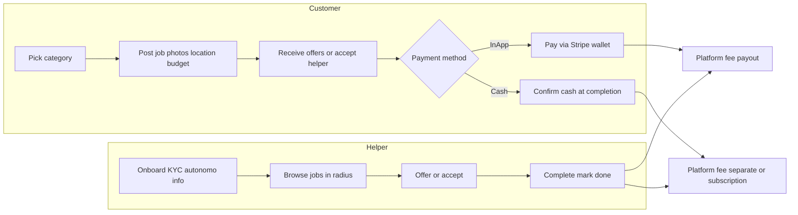
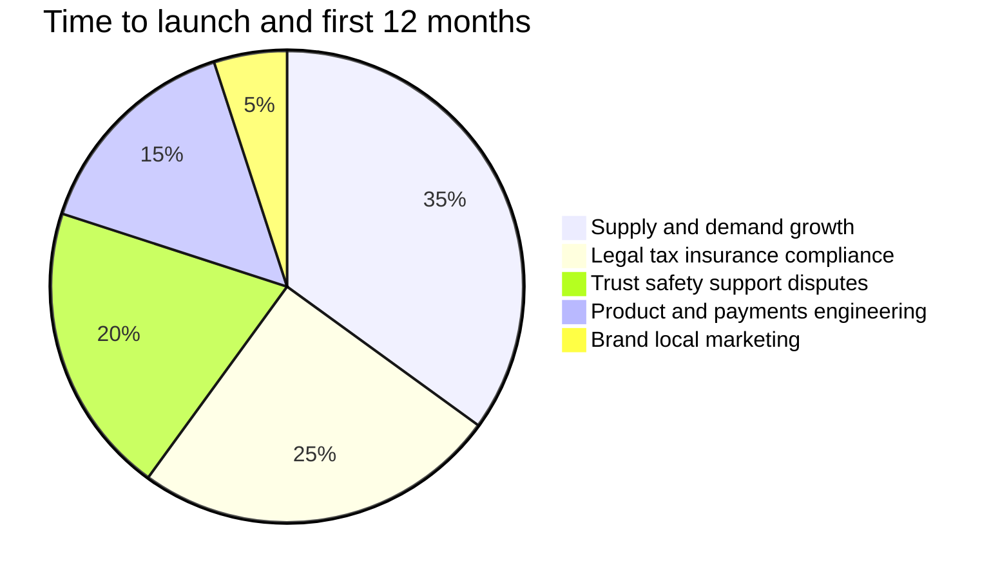

# CasaNow: Marbella home-services marketplace plan

Greenfield plan for a Marbella-first Tiptapp-style home-services marketplace: **React Native Expo + Supabase + Stripe Connect** for card/wallet payments, with an explicit **cash** workflow. You operate the legal entity in Spain; non-technical work (legal, supply/demand, trust) dominates wall-clock time.

See also: [CRITICAL_REVIEW.md](./CRITICAL_REVIEW.md) — gaps, risks, ranked challenges, and suggested v1 scope cuts.

## Checklist

- [ ] Register Spanish SL; gestoría + marketplace lawyer (GDPR, DAC7, helper status, waste category)
- [ ] Open Stripe Connect platform (ES); commission + escrow/capture + Apple/Google Pay
- [ ] Create Supabase EU project: profiles, jobs, offers, payments, RLS, Edge Functions for webhooks
- [ ] Scaffold Expo app: auth, post job with photos, Marbella geofence, offers, job lifecycle
- [ ] In-app Stripe pay + cash path with in-app platform fee and dual confirmation
- [ ] Recruit and manually vet 20–40 Marbella helpers before public launch
- [ ] Terms, privacy, moderation, report flows; TestFlight + Play submission

---

## Product vision (v1)

A **two-sided marketplace** for the Costa del Sol (launch: **Marbella + nearby municipalities**): homeowners post small domestic jobs with photos; local helpers **bid or accept** at an agreed price; payment in **app (card / Apple Pay / Google Pay)** or **cash**; you take a commission.

Inspired by the Tiptapp category grid, but adapted for Marbella demand:

| Category (ES label) | Examples |
|---------------------|----------|
| Piscina y jardín | Pool skim/clean, irrigation, patio |
| Limpieza puntual | Deep clean room, post-renovation |
| Montaje / manitas | IKEA furniture, shelves, TV mount |
| Transporte pequeño | Sofa, appliance, tip run |
| Bortforsling-style | Junk to punto limpio (regulated—see legal) |
| Recados / compras | Store pickup, auction delivery |
| Otros | Catch-all with moderation |

**Core user flows:**



---

## Recommended technical stack

| Layer | Choice | Why |
|-------|--------|-----|
| Mobile | **Expo (SDK 52+) + TypeScript + Expo Router** | Fast iOS/Android, OTA updates, good maps/camera libs |
| Backend | **Supabase** (Postgres, Auth, Storage, Realtime, Edge Functions) | Fits marketplace schema, RLS, EU region possible |
| Payments | **Stripe Connect** (Express accounts for helpers) | Spain-native; Apple Pay / Google Pay via Payment Sheet—not App Store IAP |
| Maps / geo | **Google Maps Platform** or Mapbox | Geofence jobs to Marbella polygon; distance sort |
| Push | **Expo Notifications** + FCM/APNs | Job alerts, offer accepted |
| Analytics | PostHog or Mixpanel + Sentry | Funnels, crashes |
| Admin | Retool / Supabase Studio + simple internal web (Expo web or Next later) | Moderation, disputes, refunds |

**Important payment clarification:** Apple/Google **in-app purchase (IAP)** is for *digital* goods. **Physical home services must use an external processor** (Stripe). “Pay in the app” = **Stripe Payment Sheet** with cards, **Apple Pay**, **Google Pay**, and optionally **Bizum** later via local PSP if needed—not Store billing.

### Cash + in-app together (recommended v1 model)

Tiptapp-style marketplaces struggle with pure cash because you lose commission and dispute evidence. Practical v1:

1. **In-app (default):** Customer pays **full job price + platform fee** into Stripe; funds held until completion (manual capture or separate “escrow” transfer on `job_completed`); payout to helper Connect account minus commission.
2. **Cash (explicit option):** Customer selects “Pagar en efectivo al helper”. Rules:
   - Job price is **cash off-platform** between parties.
   - Customer still pays a **small platform fee in-app** (card/Apple Pay) at booking or completion—keeps revenue and reduces fraud.
   - Both parties tap **“Confirmar efectivo recibido”**; no Stripe payout for job amount.
   - Strong Terms: platform **not liable** for cash disputes; lower trust badge.

### Supabase data model (high level)

- `profiles` (role: customer | helper | admin)
- `helper_profiles` (radius, categories, stripe_account_id, autónomo_declared boolean)
- `jobs` (status: draft → open → assigned → in_progress → completed → disputed)
- `job_photos` (Storage bucket, private + signed URLs)
- `offers` (helper_id, amount, message)
- `payments` (stripe_payment_intent_id, method: card | apple_pay | cash_job)
- `reviews`, `reports`, `service_categories`
- `geo_municipalities` (Marbella launch polygon)

**Row Level Security** on all tables; Edge Functions for: Stripe webhooks, create PaymentIntent, Connect onboarding link, geofence check.

### Expo app structure

```
app/
  (auth)/ login, register
  (customer)/ post-job, my-jobs, job/[id]
  (helper)/ browse, offers, earnings
  (shared)/ chat, profile, payments-onboarding
```

Libraries: `expo-image-picker`, `expo-location`, `@stripe/stripe-react-native`, `i18next` (es + en), `react-native-maps` or Google Maps.

### Build phases (technical)

Estimates assume **one experienced developer** who owns architecture and reviews all Cursor/AI output.

| Phase | Scope | Without Cursor | **With Cursor** (you + Agent) |
|-------|--------|----------------|-------------------------------|
| **0** | Expo scaffold, Supabase project (EU), auth, profiles | 1 week | **2–4 days** |
| **1** | Post job + photos + categories + Marbella map filter | 2 weeks | **1–1.5 weeks** |
| **2** | Offers, assign, status machine, push notifications | 2 weeks | **1–1.5 weeks** |
| **3** | Stripe Connect onboarding + in-app pay + completion payout | 3 weeks | **2–2.5 weeks** |
| **4** | Cash flow + platform fee + confirm buttons | 1 week | **3–5 days** |
| **5** | Reviews, report user, basic admin actions | 1 week | **3–5 days** |
| **6** | TestFlight/Play internal, polish, GDPR screens | 1 week | **~1 week** (little Cursor gain) |

| Summary | Calendar |
|---------|----------|
| **Without Cursor** | **~11–12 weeks** focused dev |
| **Cursor-assisted** | **~6–8 weeks** focused dev |
| **Wall-clock to beta** | Still often **10–14 weeks**—legal, Stripe verification, device testing, store review |

**What Cursor accelerates most (~40–60% faster):** boilerplate (Expo Router screens, forms, Supabase schema/RLS/migrations, i18n, Edge Function stubs, category UI).

**What Cursor barely shortens:** Stripe Connect + webhooks, payment edge cases (SCA, restricted accounts), native maps/push config, real-device QA, RLS security review, product/legal decisions. Phase 3 stays longest either way.

**Practical:** Part-time (~15–20 h/week) with Cursor → **~8–10 calendar weeks** for MVP build. Full-time with Cursor → **~6–8 weeks** engineering before private beta, then **4–8+ weeks** for SL/legal, helper seeding, store approval.

Parallel legal work should start in week 0.

---

## What takes the most time (honest split)



### 1. Supply & demand (largest long-term cost)

**Chicken-and-egg:** Without helpers, customers churn; without jobs, helpers leave.

- **Marbella specifics:** Mix of Spanish residents, expats (EN), seasonal demand, many informal cash workers already.
- **Launch tactic:** Seed **20–40 vetted helpers** before public launch (WhatsApp groups, Facebook “Manitas Marbella”, urbanización admins, pool maintenance freelancers).
- **Demand:** Facebook groups, Idealista-adjacent communities, partnerships with property managers / holiday-rental agencies.
- **Ongoing:** Not a “build and they come” product—expect **part-time ops forever** at local scale.

### 2. Legal, tax, and compliance (largest pre-launch risk)

Budget **€3k–€8k+** for Spanish gestoría + abogado (not legal advice—get counsel).

| Topic | Challenge | Action |
|-------|-----------|--------|
| **Company** | SL in Spain, CIF, bank account | Register SL; CNAE for platform/intermediation |
| **GDPR** | Photos, location, chat | Privacy policy, DPA with Supabase/Stripe, export/delete |
| **Helpers tax status** | Most regular earners must be **autónomo** | Onboarding copy + optional earnings cap; DAC7 via Stripe |
| **Platform directive** | EU 2024/2831 transpose by **Dec 2026** | Worker transparency; legal review before scale |
| **Rider law** | Delivery employment presumption | Home tasks, not delivery—helper chooses jobs/pricing; lawyer review |
| **Waste / transport** | Junk removal may need **waste carrier licences** | Restrict category at launch or licence upload |
| **Pool/chemicals** | Liability if helper damages pool | Terms + optional insurance for category |
| **Consumer law** | Withdrawal, disputes | Spanish consumer terms; ODR link |

**DAC7 / Modelo 238:** Marketplace must report helper income to AEAT—Stripe Connect helps; you still need accounting process.

### 3. Trust, safety, insurance

- **Identity:** Stripe Identity or Connect KYC; optional DNI for helpers.
- **Background checks:** Brand trust issue in ES—consider partner.
- **Insurance:** Platform does not auto-insure visits; helpers declare **RC profesional** or explore on-demand liability (hard in ES).
- **Disputes:** Playbook + you handling tickets at first.

### 4. Engineering spikes

1. Stripe Connect lifecycle
2. Job state machine + race conditions
3. Geo (urbanizaciones, gated communities)
4. Photo moderation (manual admin queue at first)
5. Realtime offer notifications

### 5. App store and payments ops

- Marketplace apps need **UGC moderation**, **report user**, terms, privacy.
- Stripe business verification: **days–weeks**.
- **SCA** (PSD2)—test thoroughly.

---

## Business decisions to lock early

1. **Commission:** 12–18% or fixed booking fee for small jobs.
2. **Pricing:** Customer sets budget + optional helper bidding.
3. **Languages:** Spanish + English day one.
4. **Service area:** Hard geofence (Marbella, San Pedro, Nueva Andalucía, etc.).
5. **Helper quality:** Manual approval first 3 months.
6. **Brand:** Confirm trademark/domain `.es` for `casanow`.

---

## Launch strategy (Marbella-first)

**Phase A – Private beta (4–6 weeks)**  
10 customers, 15 helpers, cash + card, manual support, WhatsApp feedback.

**Phase B – Public soft launch**  
TestFlight + Play Store; local expat PR; referral credit.

**Phase C – Expand**  
Estepona/Málaga only after: &lt;30 min median match, &gt;70% completion.

**Success metrics:** jobs/week, offer within 2h, completion rate, repeat customers, helper 30-day retention.

---

## Cost ballpark (first year, excluding salary)

| Item | Estimate |
|------|----------|
| Legal + gestoría setup | €3k–8k |
| Stripe + Supabase + maps + push | €200–800/mo at low volume |
| Insurance / accounting | €1k–3k/year |
| Marketing seed | €2k–10k |
| Apple Developer + Play | ~€100/year |

---

## Risks and mitigations

| Risk | Mitigation |
|------|------------|
| Low helper supply | Pre-seed helpers; subsidize first jobs |
| Cash fraud / no platform fee | Require in-app fee; limit cash to verified helpers |
| Regulatory (employment) | Helper sets price; open job board; legal UX opinion |
| Waste category fines | Disable or partners-only with licence |
| Seasonal slump | Property managers; winter pool/garden packages |

---

## Repo bootstrap (when ready to build)

1. Initialize git + Expo app in this repo
2. Supabase project (EU region), schema migrations
3. Stripe Connect platform account (Spain)
4. `docs/` launch checklist, legal TODOs, ops playbook
5. Feature flags: `cash_payments`, `category_waste`

---

## Immediate next steps (week 1)

1. **Book 2 consultations:** marketplace/employment lawyer + gestoría (SL + autónomo/DAC7).
2. **Stripe Connect** sandbox + commission/fee model.
3. **Interview 10 helpers** in Marbella (categories, cash vs card).
4. **Scaffold Expo + Supabase** while legal runs in parallel.
5. **Draft Terms + Privacy** (template + lawyer)—blocks store submission.

## Timeline summary (with Cursor)

- **Engineering only:** ~6–8 weeks full-time (vs ~11–12 without AI).
- **Technical MVP:** ~2 months full-time with Cursor.
- **Responsible Marbella launch:** **4–6 months** end-to-end (legal, insurance, helpers, stores).
- **Friends-and-family beta:** ~8–10 weeks if you accept higher legal/ops risk (not recommended as operator).
